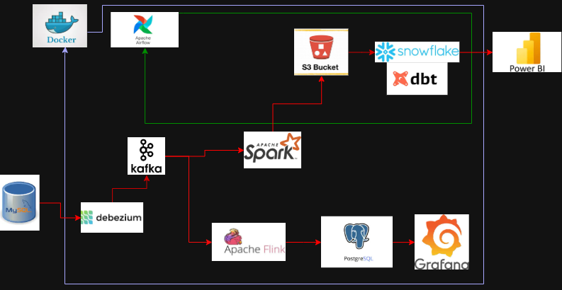
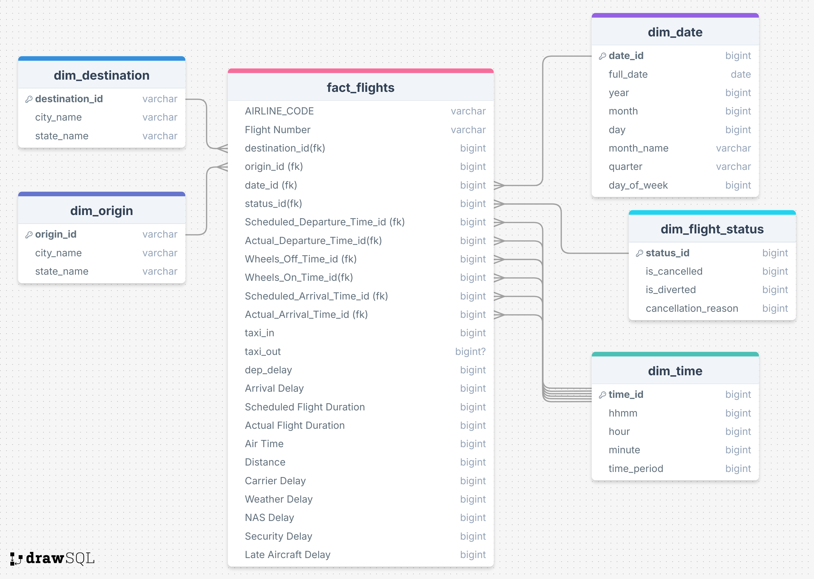
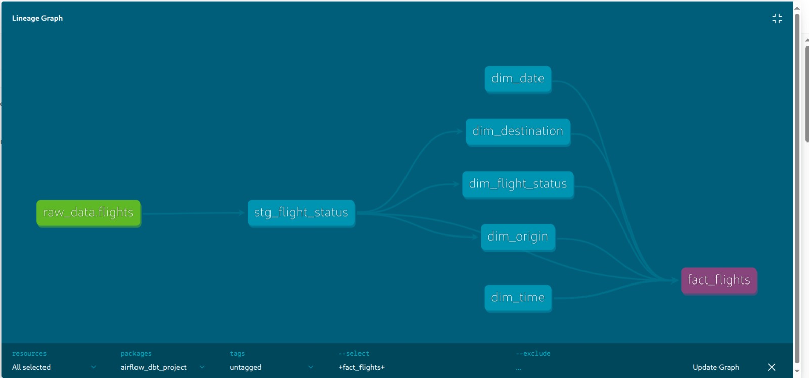
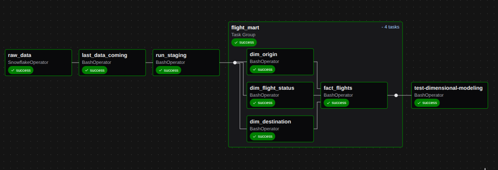

# <div>**Project Overview**</div>
- **The Flight Data Platform is a full end-to-end data engineering project that ingests, processes, analyzes, and visualizes U.S. flight operations and delay data using a hybrid (batch + real-time) architecture.
The platform is designed to support real-time monitoring, daily analytics, and enterprise-grade data modeling using modern tools such as Kafka, Spark, Flink, Airflow, Snowflake, dbt, Power BI, and Grafana.**

- **Objectives**
    - **To build a scalable data platform that can:**
      **Stream real-time flight events (delays, cancellations, diversions)**
      **Perform batch processing on large historical datasets (~7M rows && 35 columns)**
      **Produce clean dimensional models for analytics & machine learning**
      **Deliver live dashboards for decision-making**
-----
## Data Source → Kaggle 
- [Download Dataset](https://www.kaggle.com/datasets/hrishitpatil/flight-data-2024)
----
## Data dictionary about source

| **Column Name**     | **Description**                                 |
| ------------------- | ----------------------------------------------- |
| year                | Year of flight                                  |
| month               | Month of flight (1–12)                          |
| day_of_month        | Day of the month                                |
| day_of_week         | Day of week (1=Monday … 7=Sunday)               |
| fl_date             | Flight date (YYYY-MM-DD)                        |
| op_unique_carrier   | Unique carrier code                             |
| op_carrier_fl_num   | Flight number for reporting airline             |
| origin              | Origin airport code                             |
| origin_city_name    | Origin city name                                |
| origin_state_nm     | Origin state name                               |
| dest                | Destination airport code                        |
| dest_city_name      | Destination city name                           |
| dest_state_nm       | Destination state name                          |
| crs_dep_time        | Scheduled departure time (local, hhmm)          |
| dep_time            | Actual departure time (local, hhmm)             |
| dep_delay           | Departure delay in minutes (negative if early)  |
| taxi_out            | Taxi out time in minutes                        |
| wheels_off          | Wheels-off time (local, hhmm)                   |
| wheels_on           | Wheels-on time (local, hhmm)                    |
| taxi_in             | Taxi in time in minutes                         |
| crs_arr_time        | Scheduled arrival time (local, hhmm)            |
| arr_time            | Actual arrival time (local, hhmm)               |
| arr_delay           | Arrival delay in minutes (negative if early)    |
| cancelled           | Cancelled flight indicator (0=No, 1=Yes)        |
| cancellation_code   | Reason for cancellation (if cancelled)          |
| diverted            | Diverted flight indicator (0=No, 1=Yes)         |
| crs_elapsed_time    | Scheduled elapsed time in minutes               |
| actual_elapsed_time | Actual elapsed time in minutes                  |
| air_time            | Flight time in minutes                          |
| distance            | Distance between origin and destination (miles) |
| carrier_delay       | Carrier-related delay in minutes                |
| weather_delay       | Weather-related delay in minutes                |
| nas_delay           | National Air System delay in minutes            |
| security_delay      | Security delay in minutes                       |
| late_aircraft_delay | Late aircraft delay in minutes                  |
-----
## <div>**Data platform**</div>



## Architecture Overview
## The pipeline consists of two parallel flows:
- ### 1) Batch/Archival Pipeline (for AI/analytics and cost-efficiency)
    - #### Change Data Capture (CDC) is used on a MySQL database to capture every transaction log in near real-time.
    - #### Captured records, which can reach up to 1 million per second, are forwarded to S3 rather than writing directly to Snowflake, reducing write costs.
    - #### Data stored in S3 can later be used by the AI team or archived for compliance purposes.
    - #### The pipeline connects to Snowflake, enabling stakeholders to run business intelligence queries and generate insights.
    - #### Flow: MySQL CDC → S3 → Snowflake → Power BI
- ### 2) Real-Time Analytics Pipeline (for monitoring and anomaly detection)
    - #### CDC feeds data to Flink, which performs streaming transformations and analytics.
    - #### Processed real-time data is stored in Postgres for fast querying.
    - #### Grafana dashboards visualize the data to detect unusual patterns, such as increases in flight cancellations or the reasons for flight delays
    - Flow: MySQL CDC → Flink → Postgres → Grafana
 
-------
## Data modeling 
 
-------
## Data lineage in dbt
 
 ------
##  After running the DAG successfully
 

## 
--------
## How to Run
-----------
## 1) Batch/Archival running
- run that shell script to run containers and establish connection between mysql and kafka-connect
 ```
  ./startApp
 ```
- access the mysql container 

```
     docker exec -it mysql mysql -u Assem -p123456789
```
- Run that command to grant Kafka Connect the necessary permissions
```
create database GP;
GRANT ALL PRIVILEGES ON GP.* TO 'Assem'@'%';
FLUSH PRIVILEGES;

create table flights(
      id BIGINT AUTO_INCREMENT PRIMARY KEY,
            year BIGINT NOT NULL,
            month BIGINT NOT NULL,
            day_of_month BIGINT NOT NULL,
            day_of_week BIGINT NOT NULL,
            fl_date DATETIME NOT NULL,
            op_unique_carrier VARCHAR(20) NOT NULL,
            op_carrier_fl_num DOUBLE NOT NULL,
            origin VARCHAR(10) NOT NULL,
            origin_city_name VARCHAR(255) NOT NULL,
            origin_state_nm VARCHAR(255) NOT NULL,
            dest VARCHAR(10) NOT NULL,
            dest_city_name VARCHAR(255) NOT NULL,
            dest_state_nm VARCHAR(255) NOT NULL,
            crs_dep_time BIGINT NOT NULL,
            dep_time DOUBLE NULL,
            dep_delay DOUBLE NULL,
            taxi_out DOUBLE NULL,
            wheels_off DOUBLE NULL,
            wheels_on DOUBLE NULL,
            taxi_in DOUBLE NULL,
            crs_arr_time BIGINT NOT NULL,
            arr_time DOUBLE NULL,
            arr_delay DOUBLE NULL,
            cancelled INT NOT NULL,
            cancellation_code VARCHAR(10) NULL,
            diverted INT NOT NULL,
            crs_elapsed_time DOUBLE NOT NULL,
            actual_elapsed_time DOUBLE NULL,
            air_time DOUBLE NULL,
            distance DOUBLE NOT NULL,
            carrier_delay INT NOT NULL,
            weather_delay INT NOT NULL,
            nas_delay INT NOT NULL,
            security_delay INT NOT NULL,
            late_aircraft_delay INT NOT NULL
);
```
- #### You need to set up MySQL Connect to run that script, which allows you to import large amounts of data into MySQL
  ```
  pip install mysql-connector-python
    ```
- #### Assume you downloaded the data from Kaggle. Create a folder named data, then place the downloaded files inside it.
```
 python3 sparkJops/import_mysql.py
```
- #### you have two choices overwrite or append, choose what you want to import with any number

- #### Open your browser and write to see data in kafka :
```
localhost:8085
```
- #### run code pyspark code for structured streaming uploading to s3 bucket :

```
docker compose exec spark-master  spark-submit   --master spark://spark-master:7077   --packages org.apache.spark:spark-sql-kafka-0-10_2.12:3.3.0,org.apache.commons:commons-pool2:2.12.0,io.delta:delta-core_2.12:2.2.0,org.apache.hadoop:hadoop-aws:3.3.6,com.amazonaws:aws-java-sdk-bundle:1.12.529   /opt/airflow/sparkJops/consumer.py
```
---------

 #### Everything is on the cloud, so you need to reconfigure it yourself according to your personal information like access key, username, or password of snowflake configuration.


